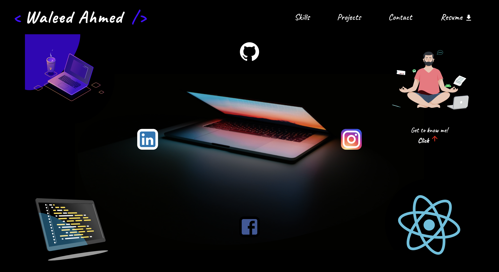
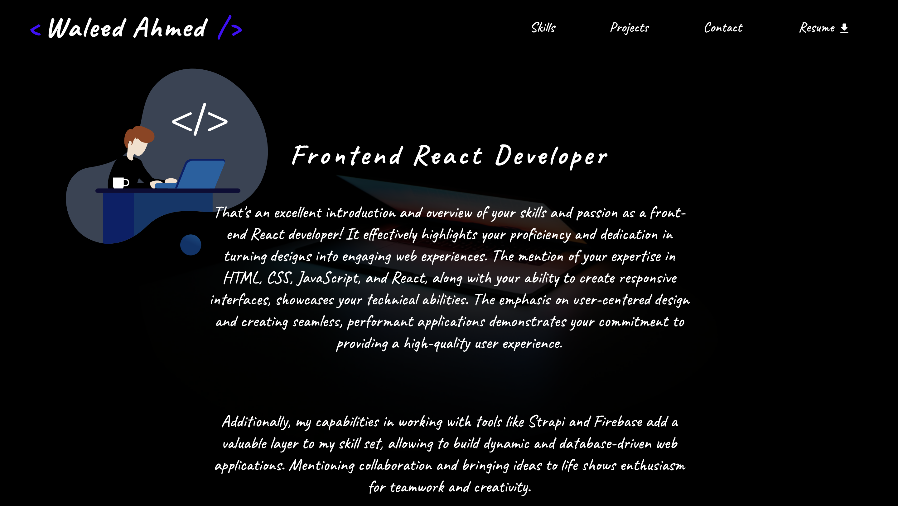
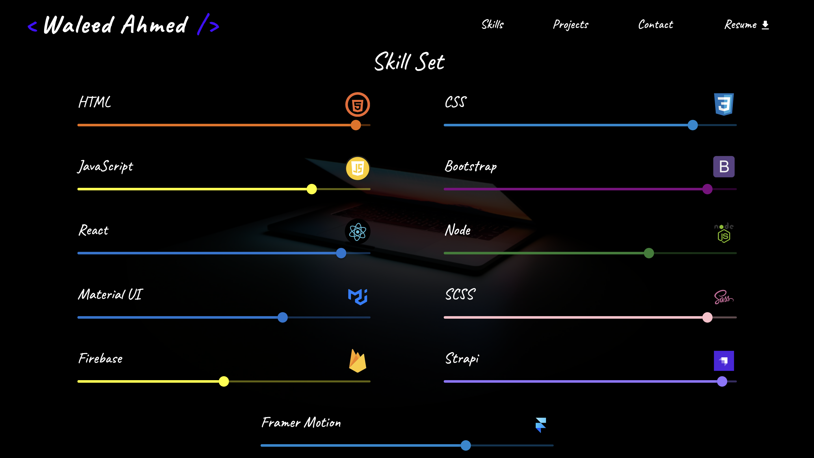
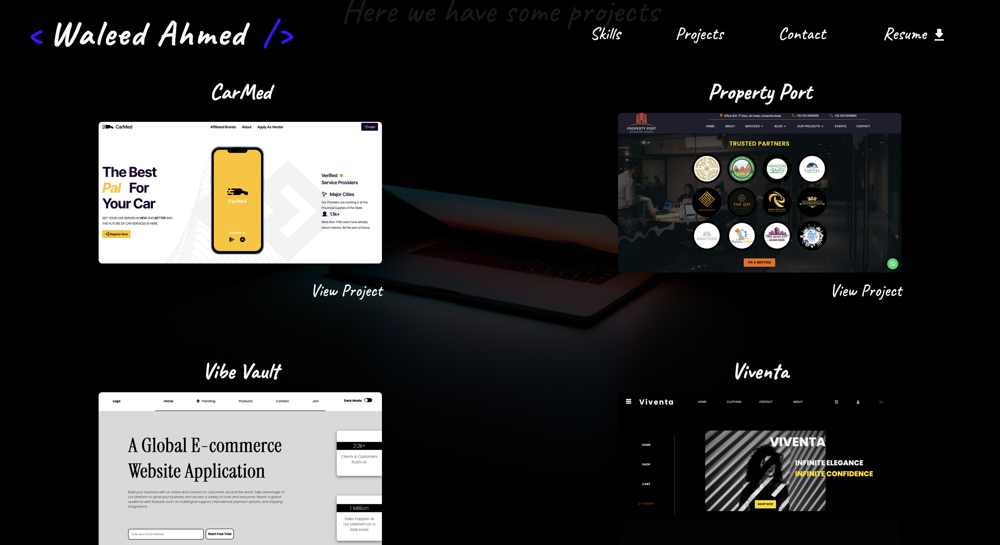

    # My Portfolio

Welcome to my GitHub repository! This is where I showcase my front-end development projects, using React to create modern and interactive web experiences.

# Visit Now: [Waleed's Portfolio](https://waleeddev.vercel.app/)

Repository: [GitHub](https://github.com/yourusername/awesome-project)

## About Section

## Skill Set Section

## Projects Section

## Contact Section

Description: Another brief description of your amazing project.

<!-- Demo: [Visit Waleed's Portfolio](https://waleeddev.vercel.app) -->

Repository: [GitHub](https://github.com/waleed2000x/Waleed)

## Technologies Used

- HTML5 & CSS3
- SCSS
- JavaScript (ES6+)
- React
- Material UI
- React-Parallax
- React Spring
- React Lottie
- Email js
- Styled-Components
- Animate on Scroll
- Framer Motion
- Turnstile | Cloudflare
- Responsive design with Flexbox/Grid
- API integration for dynamic content
- Version control with Git and GitHub

## About Me

I'm a passionate front-end developer with a focus on creating user-friendly and visually appealing web applications. With experience in React and a keen eye for design, I strive to bring innovative ideas to life.

Connect with me on [LinkedIn](https://www.linkedin.com/in/waleedahmedx) and follow me on [Instagram](https://www.instagram.com/waleedahmed.x/) for updates.

## Contact

Feel free to reach out to me at [waleedahmed2000x@gmail.com](mailto:waleedahmed2000x@gmail.com) for collaboration or inquiries.

---

Thank you for checking out my portfolio repository! Your feedback and suggestions are greatly appreciated.
